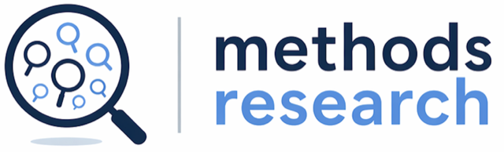

```{=html}
<a class="skip-link" href="#main-content">Skip to content</a>

<header class="site-header" id="top">
  <a class="site-mark" href="#top">
    
  </a>
  <nav class="site-nav" aria-label="Page sections">
    <a href="#projects">Projects</a>
    <a href="#about">About the group</a>
    <a href="#contact">Contact</a>
  </nav>
</header>

<main class="site-main" id="main-content">
```

# Methods Research Lab

::: {.lead}
We study how researchers develop, test, and use research methods.
:::

The methods you choose decide what your study can show. We look at how
researchers pick, test and report those methods, and we build tools that make
the choices easier.

## What we are working on {#projects}



## What we are considering {#considering}

Things we are thinking about. None of it is a promise yet.



## Related initiatives {#related}

Other people run these. We either help with them or simply find them
useful. None of them is ours.



## About the group {#about}

We are researchers at several institutions who work together on methods.
Most of us also run trials, write reviews or sit on guideline panels, and that
shapes how we study methods.

Based at the University of Basel, with international collaborators across
several institutions.

We are keen to work with other researchers interested in methods research.

### Core group



Each project card above lists the collaborators who work on it.

## Contact {#contact}

Email Stefan Schandelmaier at
[s.schandelmaier@gmail.com](mailto:s.schandelmaier@gmail.com).

```{=html}
</main>
```

::: {.site-footer role="contentinfo"}
© Stefan Schandelmaier · Methods Research Lab ·
[s.schandelmaier@gmail.com](mailto:s.schandelmaier@gmail.com) ·
Last updated  ·
Supported by an [SNSF Ambizione grant](https://data.snf.ch/grants/grant/223702){target="_blank" rel="noopener noreferrer"}.
:::
